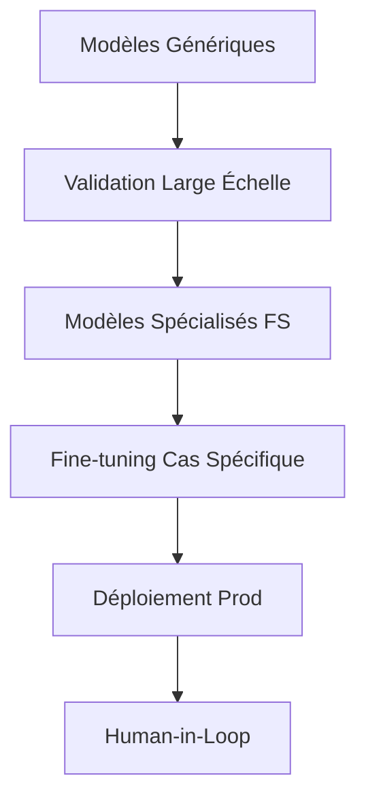
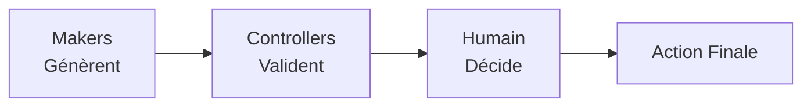

# Schéma 1 : Model Strategy IA-FS

```mermaid
graph TD
    A[Modèles Génériques] --> B[Validation Large Échelle]
    B --> C[Modèles Spécialisés FS]
    C --> D[Fine-tuning Cas Spécifique]
    D --> E[Déploiement Prod]
    E --> F[Human-in-Loop]
```

# Schéma 2 : Agent Ecosystem

```mermaid
graph LR
    A[Makers<br/>Génèrent] --> B[Controllers<br/>Valident]
    B --> C[Humain<br/>Décide]
    C --> D[Action Finale]
```

**Images générées** : 32 schémas concepts